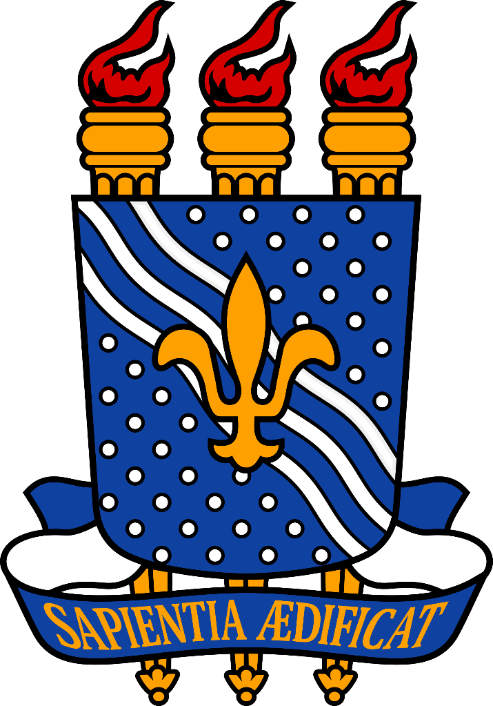

  

### UNIVERSIDADE FEDERAL DA PARAÍBA

### CAMPUS IV – CENTRO DE CIÊNCIAS APLICADAS E EDUCAÇÃO – RIO TINTO/PB

*Curso:* Licenciatura em Ciências da Computação – LCC

*Componente Curricular:* Programação Orientada a Objetos - POO

*Prof.:* Ayla Rebouças
#
*Alunos:*

Dagoberto Freire da Silva

Gabriel Cardoso da Silva

Tobias Soares Pereira

#

Rio Tinto
 2024

#
